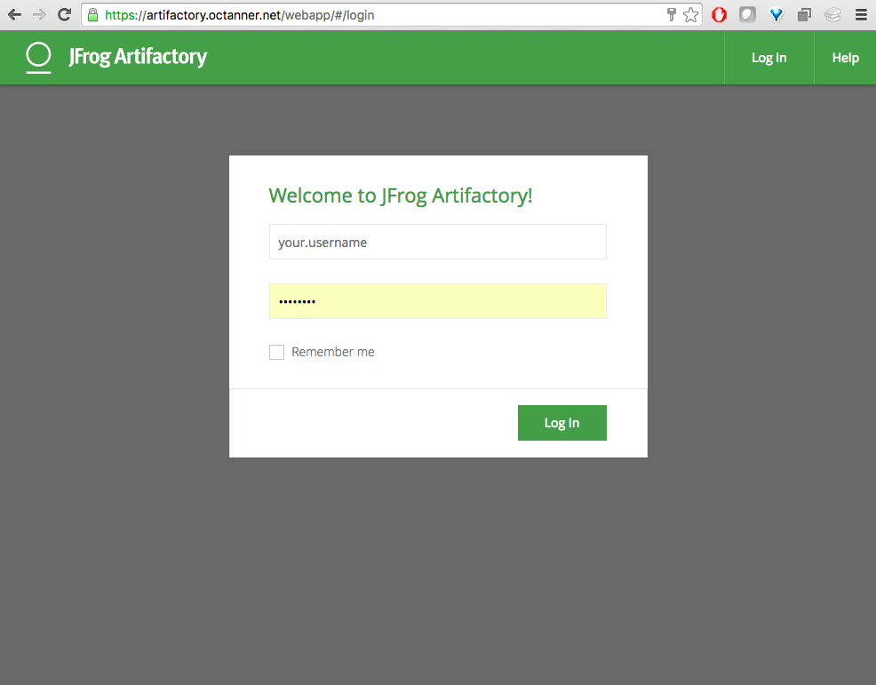
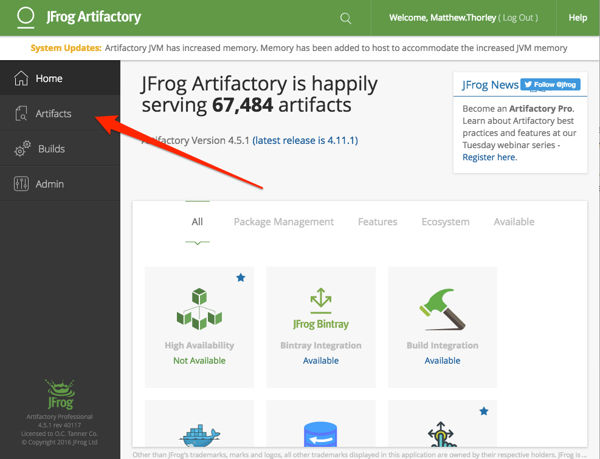
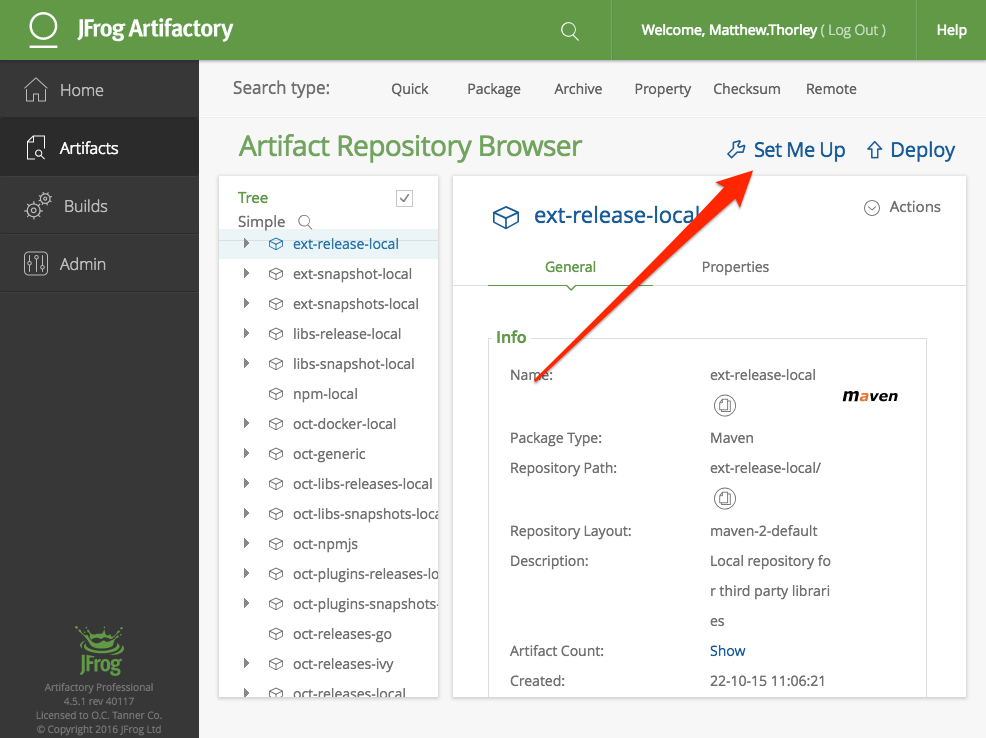
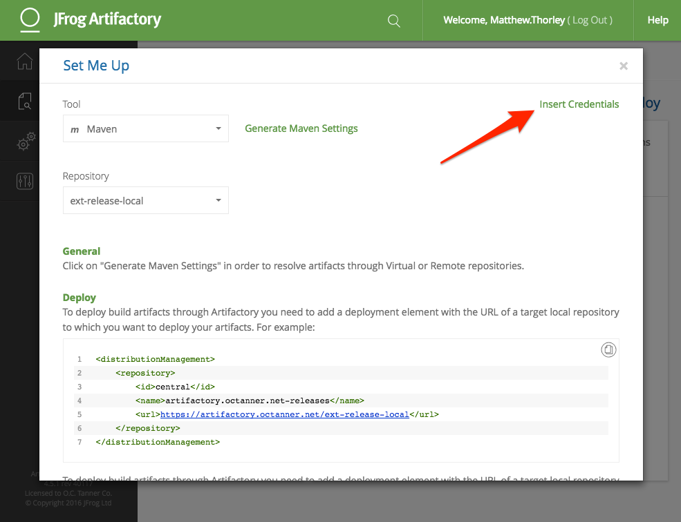
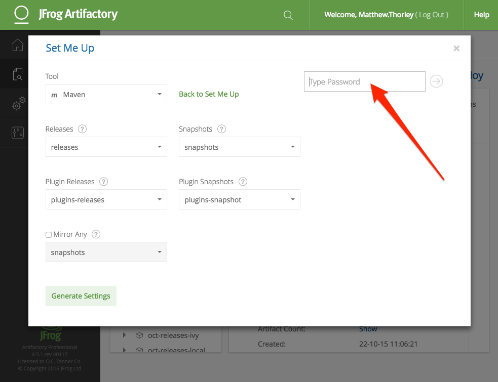
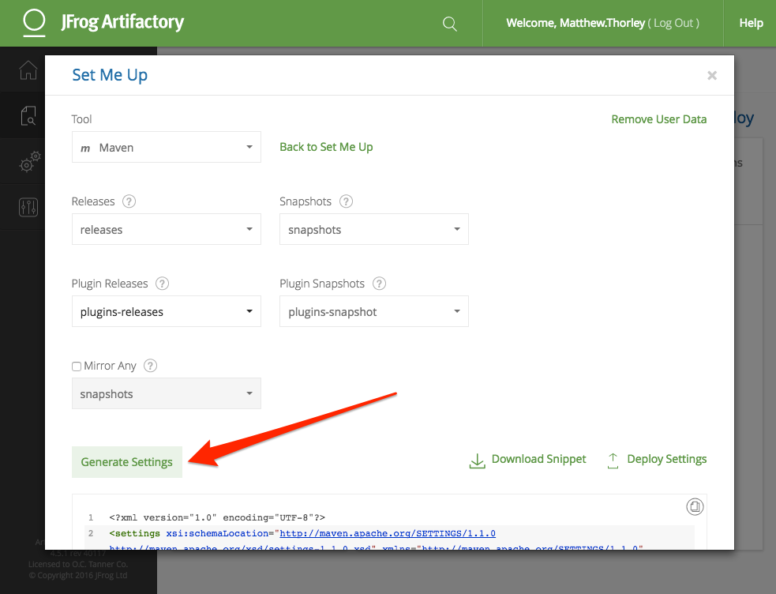
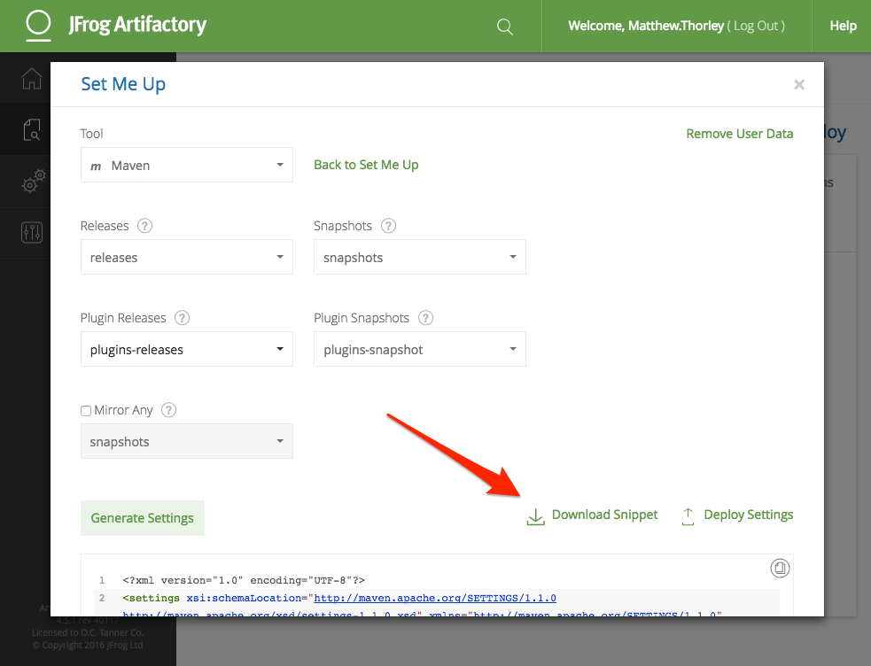

Follow the steps below to generate a Maven config file for Artifactory access.

1. Go to https://artifactory.octanner.net/webapp/#/home and login with your domain credentials

2. Click Artifacts

3. Click Set Me Up

4. Click Insert Credentials

5. Enter your domain password

6. Click Generate Settings

7. Download the file

8. Create the Maven configuration directory
```
  mkdir ~/.m2
```
9. Copy the downloaded file to the Maven configuration directory
```
  cp ~/Downloads/settings.xml ~/.m2/
```
